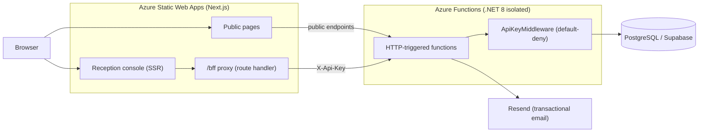

# Salon Management System

A full-stack salon management platform for **Mr. & Mrs. Cuts**. It combines a
public-facing marketing/booking website with an internal **reception console**
for staff and the salon owner to run day-to-day operations.

- **Live frontend:** https://www.mrandmrscuts.in
- **Live API:** https://mrmrscuts-api.azurewebsites.net/api

---

## Table of contents

- [Features](#features)
- [Architecture](#architecture)
- [Tech stack](#tech-stack)
- [Repository layout](#repository-layout)
- [Getting started](#getting-started)
  - [Prerequisites](#prerequisites)
  - [Backend (Azure Functions)](#backend-azure-functions)
  - [Frontend (Next.js)](#frontend-nextjs)
- [Configuration](#configuration)
- [Database & migrations](#database--migrations)
- [Authentication & security model](#authentication--security-model)
- [Deployment](#deployment)
- [Conventions](#conventions)

---

## Features

**Public site**
- Service catalogue and pricing
- Online appointment booking
- Product shop (browse + place product orders)
- Blog / posts
- Customer reviews (submit + read published reviews)

**Reception console** (`/reception`, authenticated)
- Daily appointment journal and "new booking" flow
- Customer management (profiles, notes, history, dormant-customer view, merge)
- Product & product-order management
- Blog authoring (create / edit / publish posts)
- Review moderation (approve / reject submissions before they go public)
- Staff account management (registration approval, profiles) — **owner only**
- Day-summary reporting
- Self-service password change / reset

## Architecture



- Public, read-only endpoints are called **directly** from the browser.
- Privileged endpoints are never called directly — the browser hits the
  same-origin **`/bff` proxy** (a Next.js route handler), which verifies the
  signed reception cookie and forwards the request to the API with a secret
  `X-Api-Key` header. The shared secret never reaches the client.
- The backend enforces a **default-deny** `ApiKeyMiddleware`: only an explicit
  public whitelist is reachable without the API key.

## Tech stack

| Layer    | Technology |
|----------|------------|
| Frontend | Next.js 14 (App Router, SSR/hybrid), React 18, TypeScript, Tailwind CSS |
| Backend  | .NET 8 isolated Azure Functions (HTTP triggers), Entity Framework Core 8 |
| Database | PostgreSQL (hosted on Supabase) |
| Email    | Resend |
| Hosting  | Azure Static Web Apps (frontend) + Azure Functions (backend) |
| Telemetry| OpenTelemetry → Azure Monitor / Application Insights |

## Repository layout

```
.
├── backend/                 # .NET 8 isolated Azure Functions API
│   ├── Functions/           # HTTP-triggered endpoints grouped by domain
│   │   ├── Appointments/  Customers/  Posts/  ProductOrders/
│   │   ├── Products/  Reports/  Reviews/  Services/  Staff/
│   ├── Entities/            # EF Core entity models
│   ├── DTOs/                # Request/response contracts
│   ├── Data/                # SalonDbContext + design-time factory
│   ├── Migrations/          # EF Core migrations
│   ├── Middleware/          # ApiKeyMiddleware (default-deny auth)
│   ├── Helpers/             # PasswordHasher, RateLimiter, EmailSender, OwnerSeeder, …
│   └── Program.cs           # Host + DI configuration
├── frontend/                # Next.js App Router app
│   ├── app/
│   │   ├── (public)/        # Public site (services, book, shop, blog, reviews)
│   │   ├── reception/       # Authenticated reception console
│   │   └── bff/[...path]/   # Same-origin proxy to the secured API
│   ├── components/          # Shared UI components
│   ├── lib/                 # API client, helpers, session-cookie signing
│   └── middleware.ts        # Route guard for /reception
├── global.json              # Pins the .NET SDK version
└── README.md
```

## Getting started

### Prerequisites

- **.NET SDK 8.0** (pinned in [global.json](global.json))
- **Azure Functions Core Tools v4** (`func`)
- **Node.js 20.x** and npm
- A **PostgreSQL** connection string (Supabase or local)
- A **Resend** API key (for transactional email; optional for most local work)

### Backend (Azure Functions)

```bash
cd backend

# Populate local.settings.json (gitignored) — see Configuration below
dotnet restore
dotnet build -c Release

# Run the API locally on http://localhost:7071
func start
```

> The owner account is **auto-seeded on startup** from configuration
> (`OWNER_*` settings) with a temporary password and a forced password change on
> first login — no credentials are hardcoded in source.

### Frontend (Next.js)

```bash
cd frontend

# Populate .env.local (gitignored) — see Configuration below
npm install
npm run dev   # http://localhost:3000
```

## Configuration

Secrets are **never** committed. `backend/local.settings.json` and
`frontend/.env.local` are gitignored.

**Backend — `backend/local.settings.json`** (`Values` keys):

| Key | Purpose |
|-----|---------|
| `ConnectionStrings:DefaultConnection` | PostgreSQL connection string |
| `FUNCTIONS_WORKER_RUNTIME` | `dotnet-isolated` |
| `AzureWebJobsStorage` | Storage connection (`UseDevelopmentStorage=true` locally) |
| `RESEND_API_KEY` / `RESEND_FROM` | Transactional email (Resend) |
| `FRONTEND_BASE_URL` | Used to build links in emails |
| `BACKEND_API_KEY` | Shared secret required for privileged endpoints |
| `OWNER_USERNAME` / `OWNER_FULL_NAME` / `OWNER_ROLE` / `OWNER_PHONE` / `OWNER_EMAIL` | Owner profile (auto-seeded) |
| `OWNER_TEMP_PASSWORD` | One-time temporary owner password (forces change on first login) |

**Frontend — `frontend/.env.local`:**

| Variable | Purpose |
|----------|---------|
| `NEXT_PUBLIC_API_BASE_URL` | Base URL of the API (e.g. `http://localhost:7071/api`) |
| `BACKEND_API_KEY` | Shared secret the `/bff` proxy sends as `X-Api-Key` (server-only) |
| `RECEPTION_COOKIE_SECRET` | HMAC key used to sign/verify reception session cookies |
| `NEXT_PUBLIC_SUPABASE_URL` / `NEXT_PUBLIC_SUPABASE_ANON_KEY` | Supabase client config |

## Database & migrations

The schema is managed with **EF Core migrations** in `backend/Migrations/`.

```bash
cd backend

# Create a migration after changing entities
dotnet ef migrations add <Name>

# Apply migrations to the configured database
dotnet ef database update
```

> Migrations are **not** auto-applied on deploy. After publishing backend changes
> that include a migration, run `dotnet ef database update` against the target
> database, or the dependent endpoints will fail until the schema is updated.

## Authentication & security model

- **Default-deny API:** `ApiKeyMiddleware` rejects any request to a
  non-whitelisted endpoint that lacks the correct `X-Api-Key`. The public
  whitelist lives in `backend/Helpers/PublicEndpoints.cs`.
- **BFF proxy:** browsers never hold the API key. Client-side privileged calls go
  to the same-origin `/bff` route, which validates the session cookie and adds
  the key server-side.
- **Signed session cookies:** the `reception_auth` cookie (and role/staff-id
  cookies) are HMAC-SHA256 signed via `frontend/lib/session-cookie.ts`
  (fail-closed, constant-time verification) so they can't be forged.
- **Passwords:** salted/hashed (`PasswordHasher`); owner bootstrap forces a
  password change on first login.
- **Rate limiting:** login, password-reset, and review submission are
  rate-limited (`RateLimiter` + `ClientIp`).
- **Review moderation:** submitted reviews default to **unapproved** and are held
  for owner approval before appearing publicly.
- **Security headers:** CSP, HSTS, `X-Frame-Options: DENY`, `nosniff`, referrer
  and permissions policies are served by the frontend.

## Deployment

| Component | How |
|-----------|-----|
| **Frontend** | **Auto-deploys** via GitHub Actions (`.github/workflows/azure-static-web-apps.yml`) on push to `main` that touches `frontend/**`. Target: Azure Static Web Apps. |
| **Backend** | **Manual.** From `backend/`: `func azure functionapp publish mrmrscuts-api --dotnet-isolated` (stop the local host first: `fuser -k 7071/tcp; pkill -f "func start"`). Requires `az login`. |
| **DB migrations** | Run `dotnet ef database update` against the target database after publishing migration-bearing changes. |

A scheduled `keep-warm.yml` workflow pings the API to reduce cold starts.

## Conventions

- Backend functions are grouped by domain under `backend/Functions/<Area>/`,
  one HTTP trigger per file.
- DTOs in `backend/DTOs/` define request/response shapes; entities in
  `backend/Entities/` map to the database.
- Frontend route groups: `(public)` for the marketing/booking site,
  `reception/(app)` for the authenticated console.
- Long-running UI actions always show a loader (submit buttons, navigations that
  fetch data).
